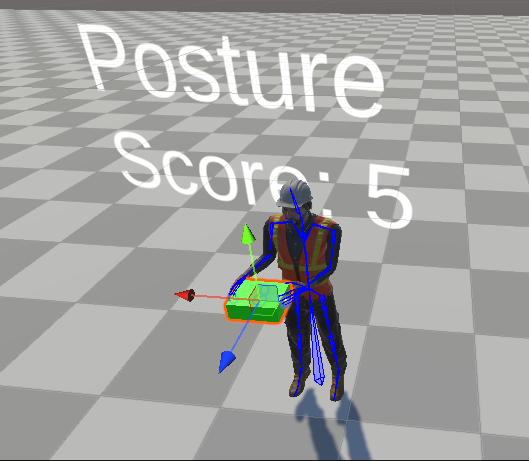

# Unity Ergonomic Optimization Scripts

This repository contains a selection of C# scripts designed for ergonomic optimization inside the Unity game engine. These scripts aim to optimize for the most ideal object handover location for human robot interaction given ergonomic scores such as REBA utilizing reinforcement learning. The goal is to extend this optimization from a virtual environemnt to real life coordinates in order to guide robot decision making for the most safe human-robot collaboration.
## Overview
This repo contains the RL regiment, REBA calculation using joint models and a selection of the Inverse Kinematic controlers.
The opitimization is performed on a humanoid 3D model:

  

In the images below, you can see the different scores dependning on the location of the box given the kinemtics and joint angles of the humanoid model:

  
  
  

After the ergonomic optimizaiton is complete and the most ideal score has been achieved, the framework saves the relative position into a csv file. From there, this relative position can be used as a reference for the robot to be able to conduct safe object handovers. 
The advantage of the RL approach and a virtual simulation is that the optimizaiton can be personalized to the worker, task and object since the user can provide the framework the necassary assets. From there the code will be able to optimize dynamically given it's new restraints. 
## Video Demonstration

To give you a better understanding of the scripts' functionality and their impact on ergonomic optimization, we have prepared a video demonstration. This video showcases the inner workings and the practical application of the scripts in a Unity project.

[View the Video Demonstration](https://youtu.be/cczKqe4NbuI)

## Code and Models Availability

All code and models featured in the video and this repository are available upon request. If you're interested in exploring these resources further or integrating them into your own projects, please don't hesitate to reach out.

## Requesting Access

To request access to the code, models, or if you have any questions, please contact us.

## Contact Information

- **Email:** [manipers71@gmail.com](mailto:your.email@example.com)

